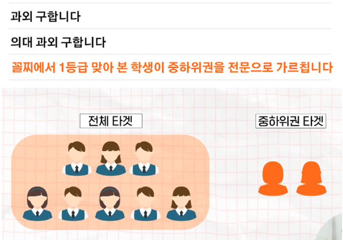

# 인간의 심리를 지배하는 글쓰기1

외적인 글쓰기 보다 훨씬 앞서야 되는게 내적인 글쓰기이다. 내적인 글쓰기가 훨씬 중요하다.

이렇게 해서 돈을 벌 수 도 있다 정도로만 가볍게 아래 2가지에 초점을 맞춰 들어보자

- 인간의 심리를 왜 이렇게 분석하는지?
- 자청이 왜 이런 사고방식을 갖는지

## 자청의 과외 구하기 글쓰기

### `상황`

자청은 20살 말부터 책을 읽기 시작해서 21\~22살에 꾸준히 22전략을 했다(2년간 매일 2시간씩 책을 읽고 글을 쓰는것). 2\~3년동안 수련을 한 후 23살이 되어 전북대 철학과에 입학을 하였다.짧은 기간동안 수능 점수를 많이 올려본 경험이 있었다.

과외를 구하려고 한다. 전북대 과외 게시판은 의대생들이 꽉 잡고 있는 중, 그 다음으로는 수의대, 수학교육과, 영어교육과 학생들이 선점하고 있는 상태.철학과는 경쟁력이 없어 보였다.

영화관 시급은 3천원, 과외는 2만원 7배 차이가 나는 시급에 과외를 구하고자 글을 쓰게 되었다.

### `포지셔닝`

기존의 과외를 구하는 글들 

⇒ “의대 본과 2학년 과외합니다. 주 2회, 50, 수학 영어 가능”

의대는 이렇게 해도 되지만, 철학과이다보니 뭔가가 더 특별해야했다.

결국에는 **포지셔닝**을 하고, 사람의 마음을 움직이는 글을 써야한다.(내적 글쓰기에서는 사람의 마음을 움직일 필요가 없고, 남을 신경을 쓸 필요도 없다)

꼴찌나 하위권애들은 과외선생님들이 기피하는게 있고 그런 친구들은 과외를 받아받자 별 소용이 없는 경우도 많이 있다. 공부를 잘해서 과외 선생이 된 사람들은 하위권의 마음이나 하위권이 어떤 사고 방식을 갖는지 모른다. 하위권을 타겟으로 한다.

### `본능분석과 반박제거`

**과외 모집글을 보는 사람** : 중 하위권 아이 or 학부모

→ 2/10명이 중하위권이라면 2명은 나의 확실한 고객이 될 수 있다.

**과외 모집 글을 읽는 사람이 떠오를 만한 반박**

- 하위권을 많이 해봤을까?
- 과외선생님은 나 같은 등수를 해봤을까? 원래 처음부터 잘했던거 아니야?
- 구체적으로 진짜 방법이 있는거야?

**과외 모집 글쓰기**

제목 : 꼴찌에서 1등급 맞아 본 학생이 중하위권을 전문으로 가르칩니다.

학부모님,

왜 꼴찌~중하위권 학생들은 과외를 받거나 학원을 다녀도 성적이 오르지 않을까요? 이유는 간단합니다.

과외 선생님들이 하위권 등수가 되어 본 경험이 없기 때문입니다. 그래서 하위권 학생들의 마음을 모르고, 어떻게 사고하는지도 모릅니다.

저는 아무리 공부해도 꼴찌를 면하지 못하는 열등생이었습니다. 하지만 수능 등급 7등급에서 2등급으로 6개월 만에 올리게 된 경험이 있습니다. 공부를 못하는 학생들의 치명적인 문제를 알게 되었는데…

- 나도 꼴찌였다.
- 그런데 내가 어떻게 수학을 1~2등급을 만들었는가? 제시하기
- 너의 감정을 정확히 알고 있고
- 그이유는 무엇이고
- 나는 어떻게 했다.

### `결과`

- 평범한 제목들 중에서 자청의 제목은 과녁을 정확히 맞추고 있다.
- 과외를 구하러 오는 사람중에 10명중에 2명이 하위권에서 중하위권이라고 하자. 과외 게시판에서 30명이 경쟁하고 있으면 8명은 30명의 싸움이고 나는 나머지 2명을 먹으면 된다.
- 이 글로 수요가 폭발했다.

글쓰기의 핵심은 **상대방을 이해하는 것**에서 출발을 한다. 

남의 마음을 파악하는 능력 키우기! 심리 공부를 해야한다.